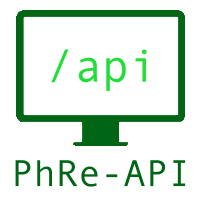

# PhRe-API - PHP REST-API
Yet another PHP Backend Framework.
The possibility that it will not bring any new features is pretty big.
Soooo... Are you sure you want to take a look at this?

Well... Here we go then!

# Documentation

## Installation
In order to have a configuration file copy the `.env.example` file and name it `.env`.

## Configuration
Inside of the `.env`-file there are a few settings you might wanna check.
You can for example specify which kinds of messages will be outputted and which ones will be suppressed.

## Error Messages and such
To output error, debug and other useful messages please use the class `PHREAPI\kernel\utils\output\Logger`.
This will also check in the `.env`-file if the message-level is even allowed to be printed out.
